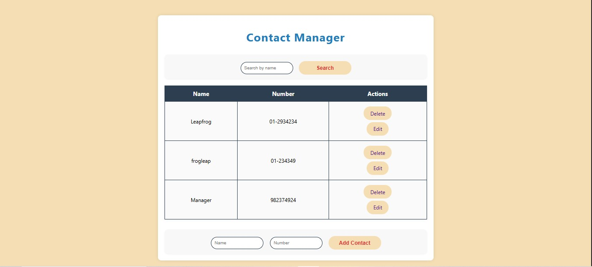

# 📇 Contact Manager App

A lightweight and responsive **Flask-based Contact Manager** that allows users to add, update, delete, and search contacts. Built with SQLAlchemy for data persistence, SCSS for styling, and Jinja2 for dynamic rendering.

---

## 🚀 Features

- ✅ Add new contacts with name and phone number
- 🔍 Search contacts by name (case-insensitive)
- 📝 Update existing contact details
- 🗑️ Delete contacts with a single click
- 🔠 Sort contacts by creation time (future support for alphabetical sorting)
- 🎨 Clean and responsive UI using SCSS
- 🗃️ Data persistence using SQLite

---

## 📁 Project Structure

```

contact-manager/
├── requirements.txt        # Requirements for this project
├── app.py                  # Main Flask application
├── database.db             # SQLite database file
├── templates/
│   ├── base.html           # Base layout
│   ├── index.html          # Main page with form and contact list
│   └── update.html         # Contact update form
├── static/
│   └── styles.scss         # SCSS for styling
├── test_app.py             # Unit tests for testing the app for better durability and bug free
├── README.md               # This file

````

---

## 💡 Technologies Used

- **Flask** — Web framework
- **SQLAlchemy** — ORM for database modeling
- **SQLite** — Lightweight local database
- **Jinja2** — Templating engine for HTML rendering
- **SCSS** — CSS preprocessor for structured styling

---

## 🛠️ Getting Started

### 1. Clone the repository

```bash
git clone https://github.com/your-username/contact-manager.git
cd contact-manager
````

### 2. Set up a virtual environment (optional but recommended)

```bash
python -m venv venv
source venv/bin/activate  # On Windows: venv\Scripts\activate
```

### 3. Install dependencies

```bash
pip install -r requirements.txt
```

> If `requirements.txt` is missing, manually install:

```bash
pip install flask flask_sqlalchemy flask_scss
```

### 4. Run the application

```bash
python app.py
```

### 5. Open in browser

Visit `http://127.0.0.1:5000/` in your browser.

---

## 🧩 Future Improvements
* 📤 Export contacts to CSV
* 🏷️ Contact categories (e.g., Work, Family, Friends)
* 🌐 API support for external integration

---

## 📸 UI design


## 🤝 Contributing

Contributions are welcome! Feel free to fork the project, open issues, or submit pull requests to improve features, fix bugs, or enhance UI/UX.

---
